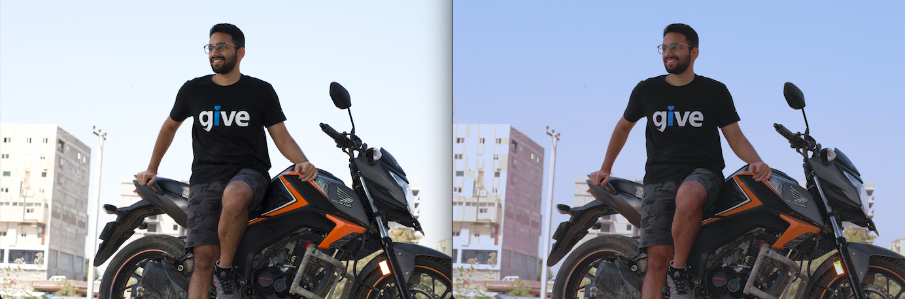

This repo uses the ML Model from the github repo (https://github.com/aiff22/DPED)

## To Run

Run below commands to setup the environment
```
pip install -r requirements.txt
mkdir -p DPED/dped/iphone/test_data/full_size_test_images

touch albumCache.json
touch albumPhotoMapCache.json
touch photoCache.json
````

> python photoEnhancer.py

The above command will ask for authorization to google photos library. It'll create a cache of album Ids and photo Ids of the selected album and run enhancements on the selected album.

Currently due to limitations of google photos api, only a jpg encoded image can be downloaded. Original photos can't be downloaded. Hence the enhancements run on the High Quality jpg image and not the original image.

So even if you have a 22+ MB RAW image, google only only allows download of 2 MB jpg version of it. 


## Sample results
